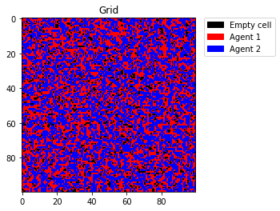

# Schelling's model of segregation

Python implementation of Schelling's model of segregation: an agent-based particle method. Each agent (in this implementation only two but potentially any number) will try to relocate to an empty cell to satisfy his desire to have neighbourhoods of his kind, if not already satisfied in his current position.

# Example of result

  
  

